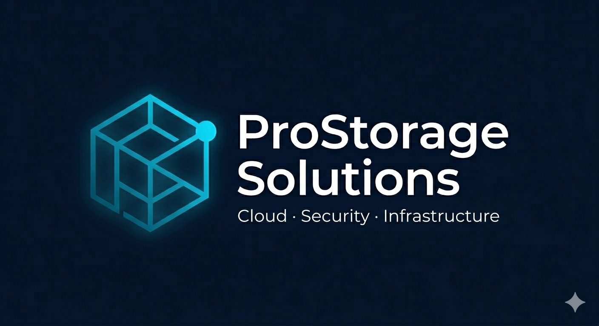

# ProStorage Solutions

  
  
  
  
  

  
  
  
  
  

## Cloud · Security · Infrastructure

ProStorage Solutions es una iniciativa enfocada en ayudar a pequeñas y medianas empresas a mejorar su infraestructura IT mediante soluciones modernas de cloud, seguridad, automatización y monitorización.

---

## Sitio web

🌐 GitHub Pages

https://harlock-code.github.io/prostorage-website/

---

## Servicios

### ☁ Cloud para empresas

- Infraestructura Microsoft Azure
- Almacenamiento empresarial
- Nube privada
- Migraciones cloud

### 🔒 Seguridad IT

- VPN WireGuard
- Hardening de sistemas
- Control de accesos
- Monitorización de seguridad

### 📊 Monitorización

- Zabbix
- Alertas y métricas
- Disponibilidad de servicios
- Supervisión de infraestructura

### 🤖 Automatización

- Ansible
- Infrastructure as Code
- Terraform
- Despliegues repetibles

---

## Tecnologías utilizadas

- Microsoft Azure
- Linux
- Docker
- Terraform
- Ansible
- WireGuard
- Zabbix
- Wazuh
- HTML5
- CSS3
- JavaScript

---

## Proyectos destacados

### ☁ Infraestructura Azure con Terraform

Despliegue automatizado de infraestructura cloud utilizando Infrastructure as Code.

🔗 https://www.linkedin.com/posts/javier-cuenca-perez-81b820368_infraestructura-como-c%C3%B3digo-en-azure-con-activity-7364663249255940096-LvYl

---

### 🔒 Centro de Seguridad con Wazuh

Implementación de una plataforma SIEM para monitorización y análisis de eventos de seguridad.

🔗 https://www.linkedin.com/posts/javier-cuenca-perez-81b820368_hardening-e-integraci%C3%B3n-de-wazuh-siem-parte-ugcPost-7387906344835514369-7l3-

---

### 📊 Monitorización con Zabbix

Monitorización de sistemas Linux y Windows mediante alertas y métricas en tiempo real.

🔗 https://www.linkedin.com/posts/javier-cuenca-perez-81b820368_parte2-monitorizaci%C3%B3n-profesional-de-nextcloud-activity-7334331049545469952-99XS

---

### 🔐 Nube privada con Nextcloud y WireGuard

Plataforma de almacenamiento empresarial segura con acceso remoto mediante VPN.

🔗 https://www.linkedin.com/posts/javier-cuenca-perez-81b820368_proyecto-nextcloud-docker-wireguard-activity-7334218593485635584-V2bu

---

### 🤖 Automatización con Ansible

Automatización de configuraciones, hardening y despliegues de infraestructura.

🔗 https://www.linkedin.com/posts/javier-cuenca-perez-81b820368_ansible-fedora42-debian12-hardening-activity-7338251889802645504-csPu

---

### 🐳 Migración de aplicación a Azure AKS

Despliegue de aplicaciones mediante Docker, Azure Kubernetes Service y Azure Container Registry.

🔗 https://www.linkedin.com/posts/javier-cuenca-perez-81b820368_migraci%C3%B3n-de-aplicaci%C3%B3n-a-azure-con-docker-activity-7365714177430040576-xNfj

---

### 🖥 Laboratorio Proxmox VE

Infraestructura virtual basada en Proxmox para simulación de entornos empresariales.

🔗 https://www.linkedin.com/posts/javier-cuenca-perez-81b820368_infraestructura-virtual-con-proxmox-ve-1-activity-7433616734177173504-sVBX

---

## Objetivo del proyecto

El objetivo de ProStorage Solutions es ofrecer soluciones IT modernas y accesibles para pequeñas y medianas empresas mediante tecnologías ampliamente utilizadas en entornos profesionales.

---

## Autor

**Javier Cuenca**

Azure Administrator Associate (AZ-104)  
Azure Solutions Architect Expert (AZ-305)  
Microsoft Certified: Azure Fundamentals (AZ-900)  
Microsoft Certified: Security, Compliance and Identity Fundamentals (SC-900)

LinkedIn:
https://www.linkedin.com/in/javier-cuenca-perez

GitHub:
https://github.com/Harlock-code

---

© 2026 ProStorage Solutions
